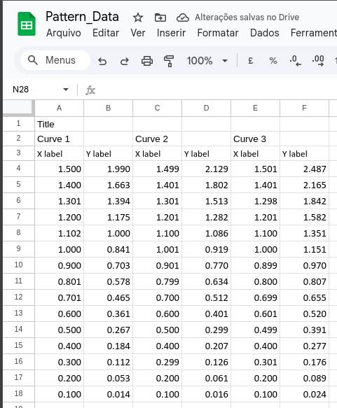
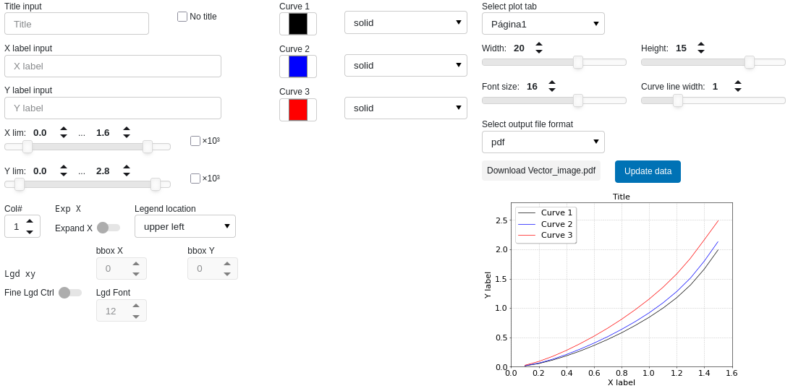

Panel for using interactive python plot functionalities for Google Sheet.

To allow the interaction with Google Sheet API, please follow the instructions from Step 1 to Step 3 in [GeekforGeekds](https://www.geeksforgeeks.org/google-sheets/how-to-automate-google-sheets-with-python/)

With the Google Sheet And Google Drive API enabled, the requirements for the Panel to work is:
 - Google Sheet name must be 'Pattern_Data'.
 - Must use 'dot' as decimal separation.

 The idea for this Panel is to enable a standard spreadsheet format to be translated into a Python plot (using matplotlib). The main elements for the Figure are defined in the spreadsheet, namely:
 - Figure Title
 - Axis labels
 - Curve legend names

 
 
 
 After following the Credentials GeekforGeek tutorial, the credetial `.json` file is provided in the initial panel:

With the defined Spreadsheet, the working panel has the following layout:

Here, it can be seen that the desired parameters are loaded and a default figure is available. This image can be download as pdf or as png.

There are several options to edit the image, for example:
 - Change Title, X and Y label.
 - X and Y limits.
 - Legend attributes, number of columns and position.
 - Curves color and line style.
 - Size of the image (width vs height).
 - Font size.
 - Curve thickness.

Also, the spreadshet can have multiple Sheets, selectable using the dropdown menu 'Select plot tab'.

'Update data' button will refresh plot to default.
 
 

